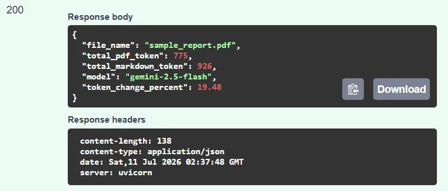
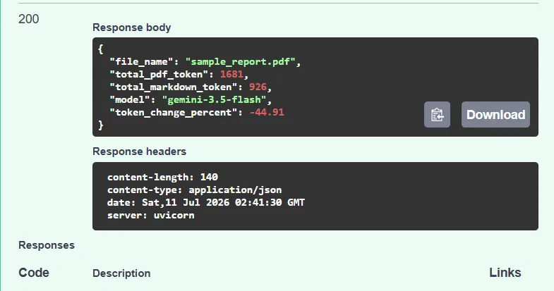
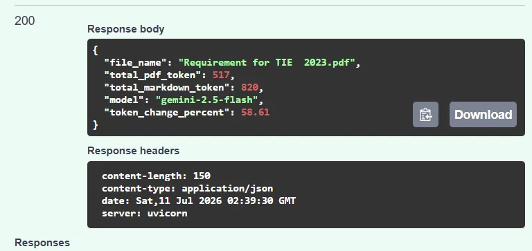
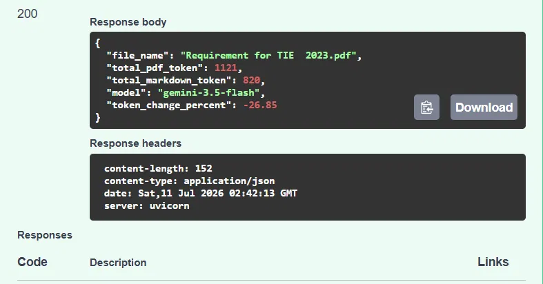

# Document Intelligence API

A FastAPI service that converts real-world documents (PDF, DOCX, PPTX, XLSX) into
clean, **LLM-ready Markdown**, then summarizes them, answers questions about them,
and measures the token cost of a document as native PDF versus converted Markdown
— all through Google's Gemini API.

This project sits at the **document ingestion layer**: the step *between* messy
source files and an LLM pipeline. Converting a document to structured Markdown
preserves its structure (headings, lists, tables) in a form language models work
with well. Whether that conversion *saves* tokens turns out to depend on the model
and the document — which is exactly why this service includes an endpoint to
**measure** the difference rather than assume it (see
[Token comparison](#the-token-comparison-finding)).

---

## Motivation

While working on a corporate chatbot in a previous role, I needed a language
model to answer questions over internal documents — policies, process
hierarchies, department interfaces, company history — all provided as PDFs.
Feeding those PDFs to the model consumed a large number of tokens per request.
One alternative was to store the documents as embeddings in a vector store, but
that introduced its own storage and query costs.

Now, building personal projects that also rely on LLMs, I kept running into the
same problem. This project is my attempt to address it using Microsoft's
open-source MarkItDown library: documents are converted into Markdown, and that
Markdown is forwarded to an LLM for summarization or question answering. Rather
than *assuming* the conversion reduces cost, the service measures it — and, as it
turns out, the answer is more nuanced than I expected.

---

## Table of Contents

- [Motivation](#motivation)
- [Features](#features)
- [Architecture](#architecture)
- [Project Structure](#project-structure)
- [Getting Started](#getting-started)
- [Environment Variables](#environment-variables)
- [Running the API](#running-the-api)
- [API Reference](#api-reference)
- [The Token Comparison Finding](#the-token-comparison-finding)
- [Scope and Limitations](#scope-and-limitations)
- [Testing](#testing)
- [Roadmap](#roadmap)
- [Tech Stack](#tech-stack)
- [References](#references)

---

## Features

**Document conversion**

- Convert `PDF`, `DOCX`, `PPTX`, and `XLSX` files into clean Markdown via a single
  endpoint — no format-specific logic on the client side.

**LLM summarization**

- Convert a document and summarize it through Gemini in one request, with a
  configurable maximum summary length. The response includes token usage.

**LLM question answering**

- Convert a document and ask a natural-language question about it. The model is
  instructed to answer using only the document, and to say when the answer is not
  present rather than inventing one. The response includes token usage.

**Token comparison**

- Measure how many tokens a PDF costs as a native upload (via the Gemini File API)
  versus as converted Markdown, and report the percentage difference. See
  [the finding](#the-token-comparison-finding) below.

**Cross-cutting**

- API key authentication on all protected routes.
- Input validation at the boundary: file-type allowlist and configurable
  maximum file size.
- Health check endpoint for monitoring and deployment probes.
- Upstream LLM failures are surfaced as a clean `502 Bad Gateway`.
- Automated tests covering happy paths, rejected file types, auth, and upstream
  failure handling.

---

## Architecture

The service follows a clean separation of responsibilities so that business
logic never lives inside HTTP handlers:

```
                          ┌──────────────────────┐
                     ─────│ DocumentService      │→ MarkItDown
Client → Router  ────│    └──────────────────────┘
   (HTTP boundary)   │    ┌──────────────────────┐
   validates input   ─────│ LLMService           │→ Gemini (generate)
   checks auth       │    └──────────────────────┘
   orchestrates      │    ┌──────────────────────┐
                     ─────│ TokenService         │→ Gemini (File API + count)
                          └──────────────────────┘
```

- **Routers** handle the HTTP layer: they validate the request, enforce
  authentication, orchestrate the services, and shape the response. They contain
  no conversion, LLM, or token-counting logic.
- **Services** each own one responsibility. `DocumentService` converts documents
  (MarkItDown). `LLMService` generates text — summaries and answers (Gemini).
  `TokenService` counts tokens, including uploading a PDF through the Gemini File
  API. None of them know anything about HTTP, which makes them easy to test in
  isolation and to reuse.
- **Settings** load configuration from environment variables, keeping secrets out
  of the codebase.

This boundary is deliberate: the LLM provider or the conversion engine can be
swapped by changing a single service, without touching the API layer. The
`TokenService` was kept separate from `LLMService` because counting tokens and
generating text are distinct responsibilities.

---

## Project Structure

```
document-intelligence-api/
│
├── api/
│   ├── __init__.py
│   ├── main.py               # app entry point, wires routers together
│   ├── settings.py           # environment-based configuration
│   ├── dependencies.py       # shared dependencies (API key auth)
│   ├── schemas.py            # Pydantic request/response models
│   ├── routers/
│   │   ├── __init__.py
│   │   ├── health.py         # GET /v1/health
│   │   └── documents.py      # convert, summarize, ask, token-comparison
│   └── services/
│       ├── __init__.py
│       ├── document_service.py   # MarkItDown conversion logic
│       ├── llm_service.py        # Gemini summarization and Q&A
│       └── token_service.py      # Gemini File API token counting
│
├── tests/
│   └── test_api_documents.py
│
├── docs/
│   └── images/              # screenshots of measured token-comparison responses
│
├── .env.example
├── .gitignore
├── requirements.txt
└── README.md
```

---

## Getting Started

### Requirements

- Python 3.10 or higher (required by MarkItDown)

### Installation

```bash
# Clone the repository
git clone https://github.com/felipenoobrega/document-intelligence-api.git
cd document-intelligence-api

# Create a virtual environment
python -m venv .venv

# Activate it — macOS/Linux:
source .venv/bin/activate

# Activate it — Windows PowerShell:
.venv\Scripts\Activate.ps1

# Install dependencies
pip install -r requirements.txt
```

---

## Environment Variables

Copy `.env.example` to `.env` and fill in the values:

```bash
cp .env.example .env
```

| Variable                | Description                                                          | Default            |
| ----------------------- | ------------------------------------------------------------------- | ------------------ |
| `APP_API_KEY`           | The key clients must send in the `X-API-Key` header                 | —                  |
| `APP_MAX_FILE_SIZE_MB`  | Maximum accepted upload size, in megabytes                          | `10`               |
| `APP_GEMINI_API_KEY`    | Google Gemini API key (required for summarize, ask, token-comparison) | —                  |
| `APP_GEMINI_MODEL`      | Gemini model used for all LLM and token operations                  | `gemini-3.5-flash` |

The `.env` file is git-ignored and never committed. `.env.example` documents the
required variables without exposing real values.

---

## Running the API

```bash
uvicorn api.main:app --reload
```

Then open the interactive documentation at:

```
http://127.0.0.1:8000/docs
```

FastAPI generates a full Swagger UI automatically, where you can upload a file
and test the endpoints directly in the browser.

---

## API Reference

### `GET /v1/health`

Health check. No authentication required.

```json
{
  "status": "ok",
  "service": "document-intelligence-api"
}
```

### `POST /v1/documents/convert`

Converts an uploaded document to Markdown. **Requires** the `X-API-Key` header.
**Request** — `multipart/form-data` with a single `file` field.

```json
{
  "file_name": "report.pdf",
  "markdown": "# Report Title\n\nDocument content...",
  "markdown_length": 1234
}
```

Errors: `400` unsupported type, `401` missing/invalid key, `413` file too large.

### `POST /v1/documents/summarize`

Converts a document to Markdown, then summarizes it via Gemini.
**Request** — `multipart/form-data` with a `file` field.
Optional query parameter: `max_words` (default `150`, range `10`–`1000`).

```json
{
  "file_name": "report.pdf",
  "summary": "A concise summary...",
  "summary_length": 320,
  "original_markdown_length": 4820,
  "prompt_tokens": 1205,
  "output_tokens": 88,
  "total_tokens": 1350
}
```

Errors: `400`, `401`, `413`, `502` (LLM provider failed).

### `POST /v1/documents/ask`

Converts a document to Markdown, then answers a question about it via Gemini. The
model is instructed to answer using only the document.
**Request** — `multipart/form-data` with `file` and `question` fields.

```json
{
  "file_name": "report.pdf",
  "question": "What was the average token reduction?",
  "answer": "The document reports an average reduction of 54 percent...",
  "original_markdown_length": 4820,
  "question_length": 38,
  "prompt_tokens": 4300,
  "output_tokens": 45,
  "total_tokens": 4400
}
```

Errors: `400`, `401`, `413`, `422` (missing question), `502` (LLM provider failed).

### `POST /v1/documents/token-comparison`

Counts how many tokens the uploaded PDF costs as a native file (uploaded through
the Gemini File API) versus as converted Markdown, and reports the percentage
difference. **PDF only.**
**Request** — `multipart/form-data` with a single `file` field.

```json
{
  "file_name": "report.pdf",
  "total_pdf_token": 1681,
  "total_markdown_token": 926,
  "model": "gemini-3.5-flash",
  "token_change_percent": -44.91
}
```

`token_change_percent` is `(markdown - pdf) / pdf * 100`. A **negative** value
means the Markdown is cheaper than the native PDF; a **positive** value means it
is more expensive. The `model` field is included because the result depends on it
(see below).

Errors: `400` (non-PDF file), `401`, `413`, `502` (File API failed).

---

## The Token Comparison Finding

A core assumption behind this project was that converting a document to Markdown
reduces the tokens needed to send it to an LLM. Instead of trusting that
assumption, the `/token-comparison` endpoint measures it. Testing two documents
across two models produced a clear — and initially surprising — result:

| Document                    | Model              | PDF tokens | Markdown tokens | Change      |
| --------------------------- | ------------------ | ---------- | --------------- | ----------- |
| `sample_report.pdf`         | `gemini-2.5-flash` | 775        | 926             | **+19.48%** |
| `sample_report.pdf`         | `gemini-3.5-flash` | 1681       | 926             | **−44.91%** |
| `Requirement for TIE 2023`  | `gemini-2.5-flash` | 517        | 820             | **+58.61%** |
| `Requirement for TIE 2023`  | `gemini-3.5-flash` | 1121       | 820             | **−26.85%** |

The token cost of a native PDF is not a property of the PDF — it is a property of
**how a given model processes PDFs**. On `gemini-3.5-flash`, native PDF processing
is expensive, so converting to Markdown saves tokens (−45% and −27%). On
`gemini-2.5-flash`, native PDF processing is lean, so the Markdown text actually
costs more (+19% and +59%). The document influences the magnitude, but in these
tests the **model** determined the direction.

The practical takeaway: there is no universal "Markdown saves X%" number. Whether
conversion helps depends on the model and the document, so the service **measures**
the trade-off per case instead of promising a fixed figure.

### Measured responses

The same document (`sample_report.pdf`) on each model:

| `gemini-2.5-flash` — Markdown costs more | `gemini-3.5-flash` — Markdown saves |
| ---------------------------------------- | ----------------------------------- |
|  |  |

A second document (`Requirement for TIE 2023.pdf`) shows the same pattern:

| `gemini-2.5-flash` | `gemini-3.5-flash` |
| ------------------ | ------------------ |
|  |  |

---

## Scope and Limitations

Being explicit about what this project does *not* do is part of using the right
tool for the job:

- **Best with digital documents.** PDF text extraction is heuristic. Software-
  generated documents convert cleanly; scanned documents, multi-column academic
  papers, and PDFs with heavy footnotes are not reliably handled and would require
  an OCR layer (out of scope).
- **Complex tables are lossy.** Spreadsheets with merged cells, formulas, or
  multi-row headers lose information when flattened to Markdown tables.
- **Security by design.** Conversion uses `convert_stream` over the received file
  bytes rather than a generic `convert` that could accept arbitrary URLs, avoiding
  server-side request forgery (SSRF). The File API path writes the upload to a
  temporary file, uploads it, and deletes both the remote and local copies in a
  `finally` block so no file is leaked even if counting fails.
- **LLM privacy.** The summarize, ask, and token-comparison endpoints send content
  to Google's Gemini API. On the free tier, Google may use submitted data to
  improve its products and may subject it to human review. Do not send sensitive
  or confidential documents when using the free tier. For private data, a paid tier
  or a zero-data-retention configuration is required.
- **Single-turn question answering.** `/ask` answers one question per request and
  keeps no conversation history — each call is independent, and the document is
  sent with every request.

---

## Testing

```bash
pytest
```

The test suite mocks the service layer, so tests run in milliseconds without
requiring real files or external API calls. Coverage includes:

- Conversion, summarization, question answering, and token comparison each return
  `200` with the expected payload.
- The token-comparison percentage is verified against known inputs.
- Unsupported file types are rejected with `400` (and the token-comparison
  endpoint rejects non-PDF files specifically).
- Requests without a valid API key are rejected with `401`.
- Upstream provider failures are surfaced as `502`.

---

## Roadmap

The service converts documents, summarizes them, answers questions, and measures
token cost. Planned extensions:

**Next**

- Structured error handling with shared custom exceptions, extracted into a module
  once there are enough to justify it.
- A small refactor to remove duplicated validation across endpoints.

**Production hardening**

- Structured field extraction (e.g. invoice number, date, total) with schema-
  constrained output.
- Docker support and `docker-compose` for one-command startup.
- CI/CD pipeline with GitHub Actions (automated tests on every push).

**Further ahead**

- Retrieval-augmented generation (RAG) for the `/ask` endpoint, so large documents
  are queried by relevant chunks instead of sending the whole document each time.

---

## Tech Stack

- **[FastAPI](https://fastapi.tiangolo.com/)** — web framework
- **[MarkItDown](https://github.com/microsoft/markitdown)** — document-to-Markdown
  conversion (Microsoft, MIT licensed)
- **[google-genai](https://pypi.org/project/google-genai/)** — official Google
  Gemini SDK
- **[Pydantic](https://docs.pydantic.dev/)** — data validation and settings
- **[Uvicorn](https://www.uvicorn.org/)** — ASGI server
- **[pytest](https://docs.pytest.org/)** — testing

---

## References

- **MarkItDown — GitHub repository:** <https://github.com/microsoft/markitdown>
- **MarkItDown — PyPI package:** <https://pypi.org/project/markitdown/>
- **MarkItDown — Security Considerations:**
  <https://github.com/microsoft/markitdown/tree/main/packages/markitdown#security-considerations>
- **Google Gen AI SDK:** <https://googleapis.github.io/python-genai/>
- **Gemini Files API:** <https://ai.google.dev/gemini-api/docs/files>
- **FastAPI documentation:** <https://fastapi.tiangolo.com/>
